Exploratory Data Analysis
================
Ian Curtis, Stacy Keydel, Sarba Uprety
2021-11-02

``` r
# Load packages
library(tidyverse)
library(lubridate)
library(funModeling)
library(Hmisc)
```

``` r
my_files <- list.files(path=here::here("original_data/"), pattern="*.csv", full.names = TRUE)
spotify <- read_csv(my_files)

# Adds a column for just the year, the track duration in seconds, and removes duplicates
spotify <- spotify %>% 
  mutate(year = substr(release_date, 1, 4),
         duration_s = as.duration(duration) / 1000) %>% 
  distinct(track_uri, .keep_all = TRUE)

# Remove empty column
spotify <- spotify[-20]
```

``` r
# Gives simple summary stats of each variable such as number of missing values, mean, percentiles, and 5 max and 5 min
descriptions <- describe(spotify)
descriptions[8]
```

    ## spotify 
    ## 
    ##  1  Variables      3020139  Observations
    ## --------------------------------------------------------------------------------
    ## track_number 
    ##        n  missing distinct     Info     Mean      Gmd      .05      .10 
    ##  3020139        0      666    0.996    9.644    9.072        1        2 
    ##      .25      .50      .75      .90      .95 
    ##        4        7       12       18       25 
    ## 
    ## lowest :   1   2   3   4   5, highest: 662 663 664 665 666
    ## --------------------------------------------------------------------------------

``` r
# Gives number of 0 values, type of data, and number of unique values
as_tibble(status(spotify))
```

    ## # A tibble: 26 × 9
    ##    variable     q_zeros    p_zeros  q_na     p_na q_inf p_inf type      unique
    ##    <chr>          <int>      <dbl> <int>    <dbl> <int> <dbl> <chr>      <dbl>
    ##  1 album_uri          0 0              0 0            0     0 character 276883
    ##  2 artist_uri         0 0              0 0            0     0 character 208526
    ##  3 artist_name        0 0           2243 0.000743     0     0 character 202171
    ##  4 album_name        13 0.00000430  2239 0.000741     0     0 character 229851
    ##  5 release_date       0 0              0 0            0     0 character  12032
    ##  6 disc_number        0 0              0 0            0     0 numeric       63
    ##  7 popularity   1391053 0.461          0 0            0     0 numeric       90
    ##  8 track_number       0 0              0 0            0     0 numeric      666
    ##  9 duration           0 0              0 0            0     0 numeric   323002
    ## 10 explicit     2779911 0.920          0 0            0     0 logical        2
    ## # … with 16 more rows

``` r
# Creates a tibble of basic summary statistics for all numerical variables
funs <- c(mean = mean, median = median, max = max, min = min, sd = sd)
spotify %>% 
  select(where(is.numeric) & !duration_s) %>% 
  map_df(~ funs %>%
           map(exec, .x), .id = "var")
```

    ## # A tibble: 16 × 6
    ##    var                     mean        median         max   min         sd
    ##    <chr>                  <dbl>         <dbl>       <dbl> <dbl>      <dbl>
    ##  1 disc_number           1.16        1             63         1      1.17 
    ##  2 popularity            7.99        1             89         0     12.2  
    ##  3 track_number          9.64        7            666         1     12.7  
    ##  4 duration         235782.     219026        6063855        18 147636.   
    ##  5 danceability          0.550       0.566          0.995     0      0.185
    ##  6 energy                0.572       0.605          1         0      0.268
    ##  7 key                   5.25        5             11         0      3.55 
    ##  8 loudness             -9.96       -8.50           4.71    -60      5.71 
    ##  9 mode                  0.666       1              1         0      0.471
    ## 10 speechiness           0.0884      0.0466         0.969     0      0.112
    ## 11 acousticness          0.374       0.247          0.996     0      0.359
    ## 12 liveness              0.210       0.13           1         0      0.189
    ## 13 valence               0.492       0.49           1         0      0.274
    ## 14 tempo               119.        120.           250.        0     30.4  
    ## 15 time_signature        3.87        4              5         0      0.505
    ## 16 instrumentalness      0.213       0.000445       1         0      0.346

``` r
spotify %>% 
  filter(year < 0100) %>% 
  summarise(min(year))
```

    ## # A tibble: 1 × 1
    ##   `min(year)`
    ##   <chr>      
    ## 1 0000

``` r
##histogram and count for reference
ggplot (data = spotify) +
  geom_histogram (mapping = aes(x = loudness), binwidth = 0.1)
```

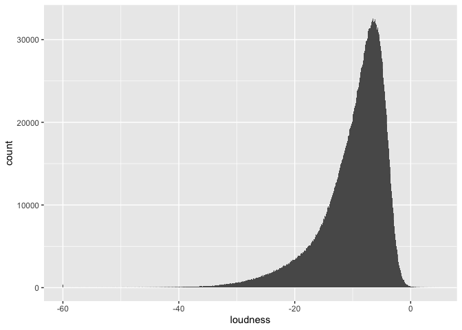<!-- -->

``` r
spotify %>% 
  filter(loudness < -50) %>% 
  select(track_name, artist_name, loudness) %>% 
  arrange(desc(loudness))
```

    ## # A tibble: 495 × 3
    ##    track_name                                       artist_name         loudness
    ##    <chr>                                            <chr>                  <dbl>
    ##  1 9027 KM                                          OK Go                  -50.0
    ##  2 Madama Butterfly: Humming Chorus                 Slovak Philharmoni…    -50.1
    ##  3 Relaxing Pink Noise                              Latium                 -50.1
    ##  4 Madame Butterfly, 1. Akt: Vogliatemi bene (Mona… Giacomo Puccini        -50.1
    ##  5 Dulled White Noise                               Lila Om                -50.2
    ##  6 Hamburglers Happy Hamburger Palace               D.R.I.                 -50.2
    ##  7 L-R Noise                                        Lübecker               -50.2
    ##  8 -                                                Kendal Johansson       -50.3
    ##  9 Copy Paste Noise                                 The 375                -50.3
    ## 10 Alone at Sea                                     Ben Sollee             -50.4
    ## # … with 485 more rows

``` r
# Some songs are silent
# Some songs are so ridiculously loud (like TV static)
```

``` r
# Boxplot of the tempo
ggplot(data = spotify, mapping = aes(x = tempo)) +
  geom_boxplot()
```

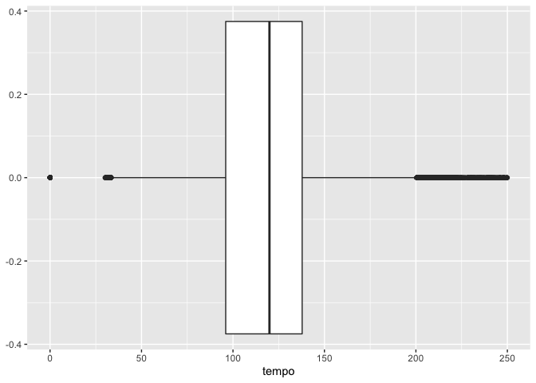<!-- -->

``` r
spotify %>% 
  filter(tempo > 200) %>% 
  select(track_name, artist_name, tempo) %>% 
  arrange(desc(tempo))
```

    ## # A tibble: 20,308 × 3
    ##    track_name                                         artist_name  tempo
    ##    <chr>                                              <chr>        <dbl>
    ##  1 Rummelboogie - Rich Vom Dorf Remix                 Audio Stunts  250.
    ##  2 Requiem of a Dream                                 Johnny D      250.
    ##  3 To the Rhythm - Ismael Rivas & Oscar de Rivera Mix Angel Moraes  250.
    ##  4 Travieso - Carlos Sánchez & Dj Ray Remix           Jose Armas    250.
    ##  5 Degas                                              DRWN.         249.
    ##  6 Life Goes On - Jimpster Remix                      Lo:rise       249.
    ##  7 Von der Klippe fallen - Harvey McKay Remix         Max Cooper    248.
    ##  8 Sofi Needs A Ladder - Pig&Dan Remix                deadmau5      248.
    ##  9 If She Is a He                                     Krause Duo    248.
    ## 10 Loop Ya                                            Third Deck    248.
    ## # … with 20,298 more rows

``` r
# 0 tempo: some are short or have a mess of sound. Some do have a tempo and this may be an error.
# Large tempo: song was recorded in half time and Spotify records it in 4/4
```

``` r
#EDA of the duration of tracks
ggplot (data = spotify) +
  geom_histogram(mapping = aes(x = duration_s), binwidth = 10)
```

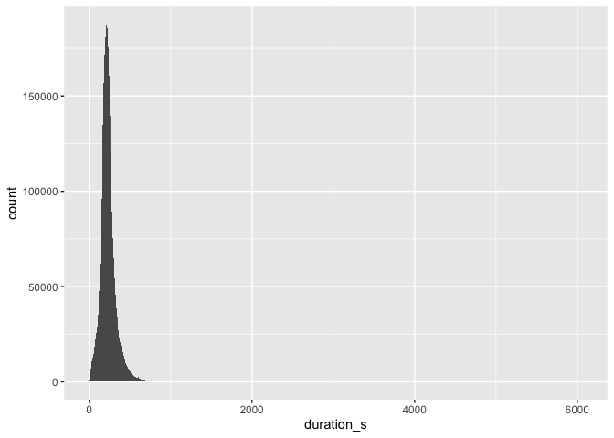<!-- -->

``` r
# Selecting the columns : names, artists and duration_s that have a duration of more than 2 seconds.
spotify %>% 
  filter(duration_s < 2) %>% 
  select(track_name, artist_name, duration_s) %>% 
  arrange(desc(duration_s))
```

    ## # A tibble: 52 × 3
    ##    track_name                              artist_name                duration_s
    ##    <chr>                                   <chr>                      <Duration>
    ##  1 Tantra                                  Orgasm Sounds              1.976s    
    ##  2 Funny Fart 6                            Fart Sound Effects         1.973s    
    ##  3 Smash 3 - Scary Halloween Sound Effects Halloween Sound Effects    1.947s    
    ##  4 Bonus Track Intro                       Jim Guthrie                1.908s    
    ##  5 We Are Young - Dance Remix              DJ Dee Bee & The Bee Zee … 1.857s    
    ##  6 Rocco Girlfriend                        Orgasm Sounds              1.836s    
    ##  7 Screams Male 3                          Royalty Free Music         1.828s    
    ##  8 Girl Orgasm                             Orgasm Sounds              1.819s    
    ##  9 Bubbling and Boiling Over a Fire        Halloween Sound Effects M… 1.817s    
    ## 10 Pleasure                                Orgasm Sounds              1.791s    
    ## # … with 42 more rows

``` r
# Some data are incorrect here; tracks are not this short
# Some songs are really this short
```

``` r
# Selecting the columns : names, artists and duration_s that have a duration of more than 2 seconds.
spotify %>% 
  filter(year < 1500) %>% 
  select(track_name, artist_name, year) %>% 
  arrange(desc(year))
```

    ## # A tibble: 110 × 3
    ##    track_name             artist_name year 
    ##    <chr>                  <chr>       <chr>
    ##  1 Mother Superior        Varien      0013 
    ##  2 Welcome To Hell        Varien      0013 
    ##  3 Shadow People          Varien      0013 
    ##  4 Death Call             Varien      0013 
    ##  5 Scrap Metal            Varien      0013 
    ##  6 Technical Difficulties Varien      0013 
    ##  7 Future Funk            Varien      0013 
    ##  8 Meteorite              Varien      0013 
    ##  9 Schizophrenia          Varien      0013 
    ## 10 The Sickness           Varien      0013 
    ## # … with 100 more rows

``` r
# There are some songs without years. 
```

``` r
# Visualization of the data
ggplot(data = spotify, mapping = aes(x = loudness, colour = explicit)) +
  geom_freqpoly(binwidth = 0.1)
```

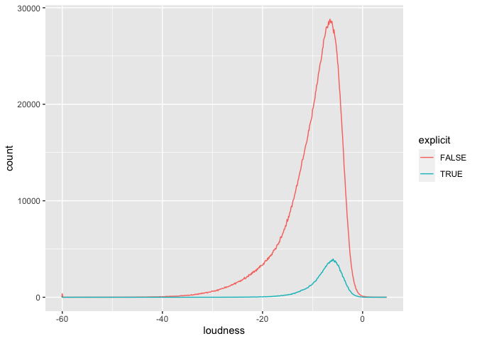<!-- -->

``` r
#boxplots of spotify to look for trends
ggplot(data = spotify, mapping = aes(x = energy)) +
  geom_boxplot()
```

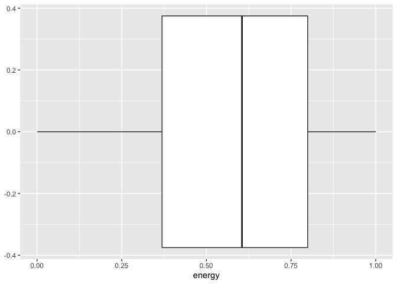<!-- -->

``` r
ggplot(data = spotify, mapping = aes(x = popularity)) +
  geom_boxplot()
```

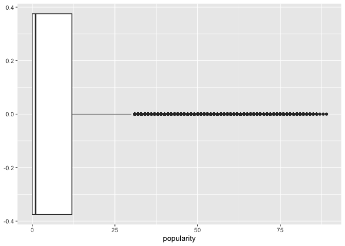<!-- -->

``` r
ggplot(data = spotify, mapping = aes(x = danceability)) +
  geom_boxplot()
```

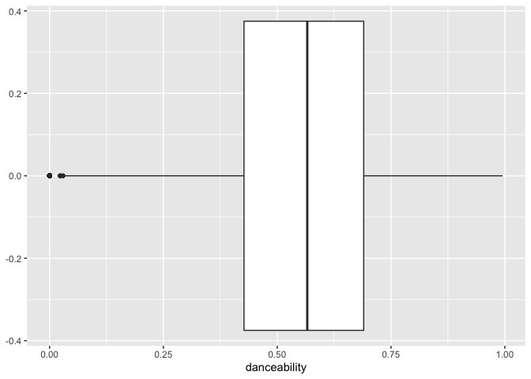<!-- -->

``` r
ggplot(data = spotify, mapping = aes(x = key)) +
  geom_boxplot()
```

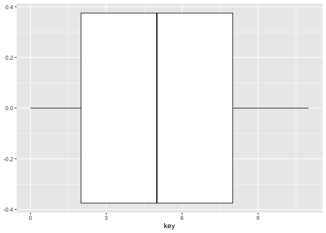<!-- -->

``` r
ggplot(data = spotify, mapping = aes(x = loudness)) +
  geom_boxplot()
```

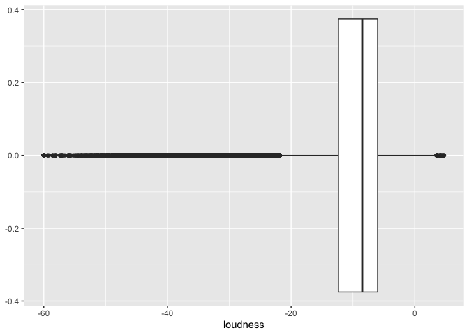<!-- -->

``` r
ggplot(data = spotify, mapping = aes(x = speechiness)) +
  geom_boxplot()
```

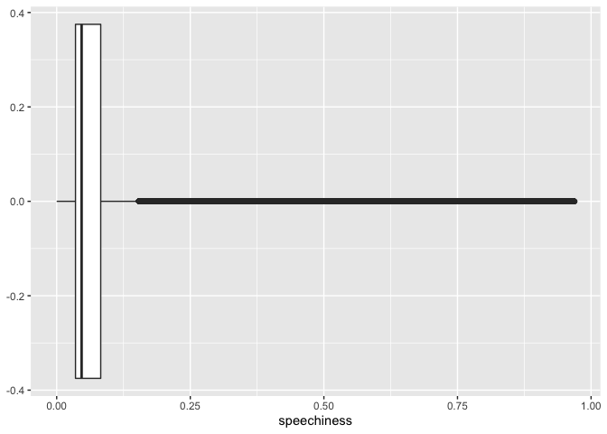<!-- -->

``` r
ggplot(data = spotify, mapping = aes(x = acousticness)) +
  geom_boxplot()
```

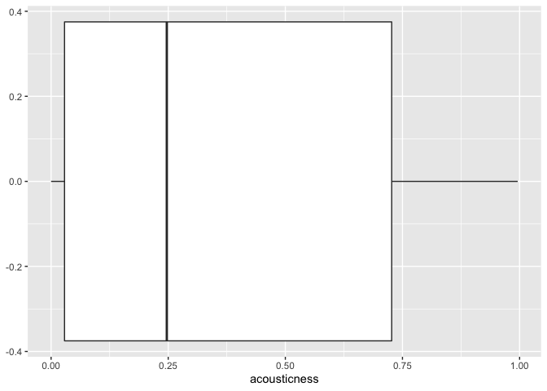<!-- -->

``` r
ggplot(data = spotify, mapping = aes(x = liveness)) +
  geom_boxplot()
```

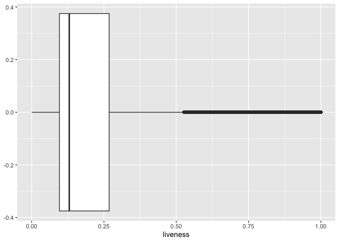<!-- -->

``` r
ggplot(data = spotify, mapping = aes(x = valence)) +
  geom_boxplot()
```

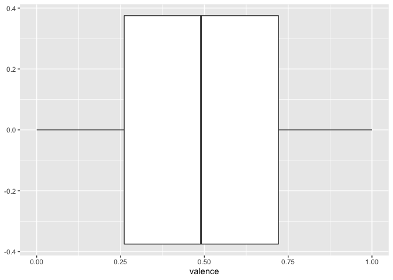<!-- -->
